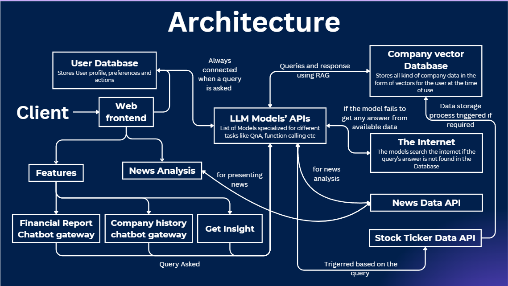
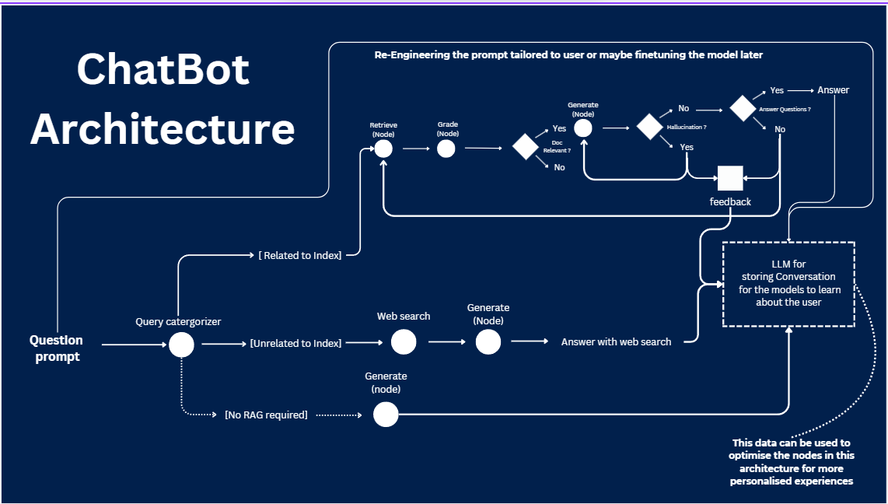
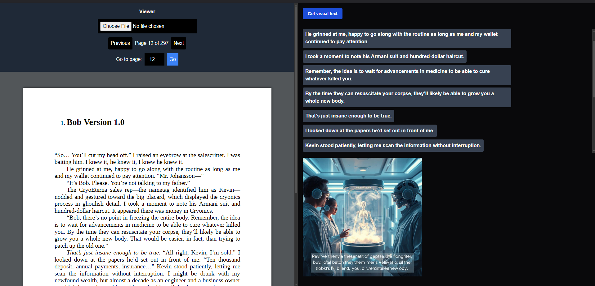

# Projects

Below are some of my big projects which I have worked/been working on. Other projects can be explored in github

### Predify.ai

- [Demo video](https://youtu.be/MdShMAbSQaA)
- Architectures
    
    
    
    
    

### Thesius.ai

- This is my latest project.
- [Frontend Website](https://thesius-ai.vercel.app/)
- currently a work in progress, will deploy the fullstack before 31st
- JARVIS
    - [github](https://github.com/SWARAJ-42/JARVIS)
- chatroom-copilot
    - This is basically an anonymous chatroom where there is a public/private co-pilot to involve in the group conversation and also provide summary of the whole conversation if a new users joins the chatroom and wants to know the context of the whole convo.
    - Unfortunately I haven't documented this project nor deployed. But can surely give you a demo of the project during the meet.
    - [github](https://github.com/SWARAJ-42/chatroom-copilot)

### Imaginovel

- Project Description:
    - This is a tool that helps you visualize your Novel. It extracts all the texts from a page which require visualizations and generates a AI generated Image for the text.
    - Sorry I haven’t upload this project to github, Since this is a work in progress project
    
    
    
- Transformer-from-scratch
    - Built a complete encoder-decode transformer model(from attention is all you need paper) from scratch
    - [github](https://github.com/SWARAJ-42/transformer-from-scratch)
- Machine-learning-models-from-scratch
    - I have implemented some of the common machine learning models from scratch and made them completely modular
    - [github](https://github.com/SWARAJ-42/Machine-Learning-Models)